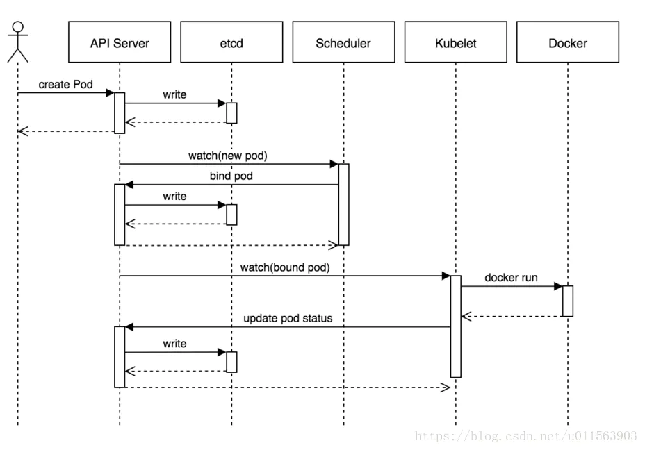

Kubernetes入门教程 
- 原文   https://www.jianshu.com/p/e1cc6903b391
- 官网   https://kubernetes.io/zh-cn/docs/tutorials/


### 一、Kubernetes是什么

Kubernetes 这个名字源于希腊语，意为“舵手”或“飞行员”，简称 k8s，8代表中间的八个字符
Google 在 2014 年开源了 Kubernetes 项目，是Google基于Borg开源的容器编排调度引擎。作为CNCF（Cloud Native Computing Foundation）最重要的组件之一，它不仅仅是一个编排系统，而是一种规范或者标准，目前已是容器生态的标准。

官方定义：

- `Kubernetes` 是用于自动部署，扩展和管理容器化应用程序的开源系统；一个可移植的、可扩展的开源平台，用于管理容器化的工作负载和服务，可促进声明式配置和自动化。

### 二、Kubernetes 能做什么

- 先回顾一下容器部署好处，更快速的交互与部署，更高效的资源利用，更轻松的迁移和扩展、维护。

- Kubernetes 不是传统的Paas系统 ，它提供了构建开发人员平台的基础，默认解决方案都是可选和可插拔的，有效保留了用户的选择和灵活性，利用声明式API简化用户的使用。可以说是把简单留给用户，把复杂留给自己，这也是技术发展的使然。

简单来说：

Kubernetes用户可以通过编写一个yaml或者json格式的配置文件，也可以通过工具/代码生成或直接请求Kubernetes API创建应用，该配置文件中包含了用户想要应用程序保持的状态，不论整个Kubernetes集群中的个别主机发生什么问题，都不会影响应用程序的状态，你还可以通过改变该配置文件或请求Kubernetes API来改变应用程序的状态。

- 服务编排
  kubernetes 允许声明式配置，自动编排服务，存储自动挂载等等

- 自动部署和回滚、修复
  自动按期望状态自动部署容器，当版本升级出错也能实现按期望回滚，自动修复启动失败的容器，替换或者kill掉不响应用户定义的运行状态检查的容器。

- 服务发现和负载均衡
  提供service，ingress 的组件，实现服务发现和负载均衡

- 密钥与配置管理
  可以把部署和配置分离，单独管理应用程序配置以及敏感信息，比如密钥、令牌和密钥等，可以在不重建容器镜像情况下部署和更新配置，无须在声明式配置中暴露敏感信息

### 三、 Kubernete安装

参考：https://www.jianshu.com/p/4d3d48d61e94

### 四、 Kubernate使用

入门例子

```js
apiVersion: v1 #指定资源版本
kind: Pod #指定pod对象 命令kubectl api-resources查看所有
metadata:
  name: nginx-demo
spec:
  containers:
  - name: nginx
    image: nginx:1.14.2
    ports:
    - containerPort: 80
```


#### Pod 对象

Pod 是可以在 Kubernetes 中创建和管理的、最小的可部署的计算单元。每个Pod有独立的空间，比如独立内网IP，可以简单理解成一台轻量级的机器

- 每个Pod一个容器
  该模型是最常见的kubernetes用例，每个

- Pod运行多个协同工作的容器
  Pod 可能封装由多个紧密耦合且需要共享资源的共处容器组成的应用程序，pod内的容器之间共享空间，比如存储，网络。

#### ReplicaSet

ReplicaSet的目的是维护一组在任何时候都处于运行状态的 Pod 副本的稳定集合。 因此，它通常用来保证给定数量的、完全相同的 Pod 的可用性。

```js
apiVersion: apps/v1 #指定资源版本
kind: ReplicaSet #指定pod对象 命令kubectl api-resources查看所有
metadata:
  name: nginx-rs
  labels:
    app: nginx
spec:
  replicas: 2
  selector:
    matchLabels:
      app: nginx
  template:
    metadata:
      labels:
        app: nginx
    spec:
      containers:
       - name: nginx
         image: nginx:1.14.2
         ports:
         - containerPort: 80
```

#### 1.工作负载

工作负载是在 Kubernetes 上运行的应用程序,Kubernetes 提供若干种内置的工作负载资源，用来管理pod整个生命周期。这些内置的资源对象也可以叫做控制器（控制器模式）

##### （1）Deployments

```js
apiVersion: apps/v1
kind: Deployment
metadata:
  name: nginx-deployment
  labels:
    app: nginx
spec:
  replicas: 3 #默认值是1，默认都创建ReplicaSet 对象
  selector:
    matchLabels:
      app: nginx
  template:
    metadata:
      labels:
        app: nginx
    spec:
      containers:
      - name: nginx
        image: nginx:1.14.2
        ports:
        - containerPort: 80
```

##### （2）DaemonSet

DaemonSet 确保全部（或者某些）节点上运行一个 Pod 的副本。 当有节点加入集群时， 也会为他们新增一个 Pod 。 当有节点从集群移除时，这些 Pod 也会被回收。删除 DaemonSet 将会删除它创建的所有 Pod。典型用法，比如每个节点上运行集群守护进程，日志收集，运行监控等等。
具体使用与Deployments一样，对象改成DaemonSet，去掉replicas配置

> DaemonSet 与 Deployments非常类似,都是针对无状态的服务，而DaemonSet提供是节点级别的控制，确认Pod副本总是运行在全部或者部分节点上，不支持replicas

##### （3）StatefulSet

StatefulSet 是用来管理有状态应用的工作负载 API 对象

```js
apiVersion: v1
kind: Service
metadata:
  name: nginx
  labels:
    app: nginx
spec:
  ports:
  - port: 80
    name: web
  clusterIP: None  #代表headless 无头服务,不会进行负载均衡,也不会为该服务分配集群 IP,自动配置 DNS
  selector:
    ainx
---
apiVersion: apps/v1
kind: StatefulSet
metadata:
  name: web
spec:
  selector:
    matchLabels:
      app: nginx # has to match .spec.template.metadata.labels
  serviceName: "nginx"
  replicas: 2 # by default is 1
  template:
    metadata:
      labels:
        app: nginx # has to match .spec.selector.matchLabels
    spec:
      terminationGracePeriodSeconds: 10
      containers:
      - name: nginx
        image: nginx:1.14.2
        ports:
        - containerPort: 80
          name: web
        volumeMounts:
        - name: www
          mountPath: /usr/share/nginx/html
  volumeClaimTemplates:
  - metadata:
      name: www
    spec:
      accessModes: [ "ReadWriteOnce" ]
      storageClassName: "my-storage-class"
      resources:
        requests:
          storage: 1Gi
```

##### （4）Jobs

Job 会创建一个或者多个pods，直到指定数据的Pods成功终止。

```js
apiVersion: batch/v1
kind: Job
metadata:
  name: hello-job 
spec:
  parallelism: 2 #并行数量
  completions: 10 #执行数量
  template:
    spec:
      containers:
      - name: hello
        image: busybox
        command: ["echo","hello k8s job!"]
      restartPolicy: Never
#可以简单理解成为并行两个pod，总共运行完10个pod结束job
```

##### （5）CronJob

CronJob 创建基于时隔重复调度的 Jobs，也叫定时job

```js
apiVersion: batch/v1beta1
kind: CronJob
metadata:
  name: hello-cronjob
spec:
  schedule: "*/1 * * * *"
  jobTemplate: # 定义的模板跟前面job 是一样的
    spec:
      completions: 2 #执行数量
      template:
        spec:
          containers:
          - name: hello
            image: busybox
            command: ['/bin/sh', 'c',  'date &&  echo ":Hello K8s"']
          restartPolicy: OnFailure
#每隔一分钟执行一次job，其实本质上会创建一个job
```

#### 2.服务

Service 是对一组Pods的逻辑抽象，通常称为微服务。

```js
apiVersion: v1
kind: Service
metadata:
  name: nginx-service 
spec:
  selector:          #选择算符
    app: nginx  
  ports:
    - protocol: TCP
      port: 8080   #服务端口,service暴露在cluster ip上的端口
      targetPort: 80  #pod上的端口,容器的端口
```

> 具有选择算符才能自动创建相对应的Endpoint对象，否则需要手动创建

```js
apiVersion: v1
kind: Endpoints
metadata:
  name: my-service
subsets:
  - addresses:
      - ip: 192.0.2.42  #cluster ip
    ports:
      - port: 8080  #
```

##### 服务类型

- ClusterIP：k8s默认的ServiceType，通过集群内的ClusterIP在内部发布服务
- NodePort：用来对集群外暴露Service，你可以通过访问集群内的每个NodeIP:NodePort的方式，访问到对应Service后端的Endpoint
- LoadBalancer: 这也是用来对集群外暴露服务的，不同的是这需要外部负载均衡器的云提供商，比如AWS等
- ExternalName：这个也是在集群内发布服务用的，需要借助KubeDNS(version >= 1.7)的支持，就是用KubeDNS将该service和ExternalName做一个Map，KubeDNS返回一个CNAME记录。

##### 服务发现

Kubernetes 支持两种基本的服务发现模式 —— 环境变量和 DNS

- DNS
  k8s官方强烈推荐的方式!使用附加组件为 Kubernetes 集群设置 DNS 服务，比如CoreDNS

- 环境变量
  当你创建一个Pod的时候，kubelet会在该Pod中注入集群内所有Service的相关环境变量。需要注意: 要想一个Pod中注入某个Service的环境变量，则必须Service要先比该Pod创建

##### Kube-proxy代理模式

kube-proxy当前实现了三种代理模式：userspace, iptables, ipvs

- userspace
  userspace是在用户空间，通过kube-proxy来实现service的代理服务，service的请求会先从用户空间进入内核iptables，然后再回到用户空间，由kube-proxy完成后端Endpoints的选择和代理工作，这样流量从用户空间进出内核带来的性能损耗是不可接受的，v1.2版本之前的默认模式

- iptables
  kube-proxy 持续监听 Service 以及 Endpoints 对象的变化，并设置进本地节点iptables，请求反向代理全部交给 iptables 来实现，v1.2版本之后的默认模式

- ipvs
  在 ipvs 模式下，kube-proxy 监视 Kubernetes 服务和端点，调用 netlink 接口相应地创建 IPVS 规则， 并定期将 IPVS 规则与 Kubernetes 服务和端点同步。 该控制循环可确保IPVS 状态与所需状态匹配。访问服务时，IPVS 将流量定向到后端Pod之一，v1.8以后新支持的

#### 3.配置管理

提供独立配置信息管理，实现配置信息和容器镜像解耦，便于应用配置的修改，主要包含两类对象ConfigMap和Secret。

##### ConfigMap

ConfigMap提供非机密性的数据供Pod使用

yaml文件创建

```js
apiVersion: v1
kind: ConfigMap
metadata:
  name: web-cm
data:
  # 类属性键；每一个键都映射到一个简单的值
  connection_count: "3"
  config_file: "application.properties"
  # 类文件键
  application.properties: |
    max_connection=10
    connection_url=https://kubernetes.io/      
```

 

- kubectl create configmap 命令创建类文件键

```js
#创建key=application.properties的类文件键
kubectl create configmap web-cm --from-file=application.properties=/usr/local/src/application.properties

#具体使用参考命令
kubectl create configmap -h
```


##### Pod引用configmap

通过设置pod的volume，可以作为容器命令和参数或者环境变量，也可以让应用来读取配置

```js
apiVersion: v1
kind: Pod
metadata:
  name: cm-pod
spec:
  containers:
    - name: cm-pod
      image: busybox
      command: ["/bin/sh","-c",  "echo $CONFIG_FILE&&cat /config/applications   && sleep 3600"]
      env:
        # 定义环境变量
        - name: CONFIG_FILE# 请注意这里和 ConfigMap 中的键名是不一样的
          valueFrom:
            configMapKeyRef:
              name: web-cm           # 这个值来自 ConfigMap
              key: config_file# 需要取值的键
      volumeMounts:
      - name: config
        mountPath: "/config"
        readOnly: true
  volumes:
    # 你可以在 Pod 级别设置卷，然后将其挂载到 Pod 内的容器中
    - name: config
      configMap:
        # 提供你想要挂载的 ConfigMap 的名字
        name: web-cm
        # 来自 ConfigMap 的一组键，将被创建为文件
        items:
        - key: "application.properties"
          path: "application.properties"
```


##### Secret

Secret对象主要用于存储一些敏感信息例如密码、令牌或密钥，支持多种内置类型。

##### 默认Opaque

```js
apiVersion: v1
kind: Secret
metadata:
  name: web-secret
type: Opaque
data:
  username: YWRtaW4=        #admin的base64位
  password: YWRtaW5fcGFzc3dvcmQK #admin_password 的base64位
```

```js
apiVersion: v1
kind: Pod
metadata:
  name: secret-pod
spec:
  containers:
  - name: secret-pod
     image: busybox
     command: ["/bin/sh","-c",  "cat /config/username   && sleep 3600"]
    volumeMounts:
    - name: config
      mountPath: "/config"
      readOnly: true
  volumes:
  - name: config
    secret:
      secretName: web-secret
```


##### 配置docker镜像秘钥

```js
kubectl create secret docker-registry harbor-token --docker-server=<your-registry-server> --docker-username=<your-name> --docker-password=<your-pword> 
#harbor-token: 指定密钥的键名称, 可自行定义
#--docker-server: 指定docker仓库地址
#--docker-username: 指定docker仓库账号
#--docker-password: 指定docker仓库密码
```


k8s yaml 文件制定仓库秘钥

```js
spec:
     imagePullSecrets:
       - name: harbor-token
      containers:
```


#### 4.命名空间管理

Kubernetes支持namespace管理，用于资源分隔管理，比如按环境分隔，按团队，按用户场景。
同一个命名空间下资源名称是唯一，同一个资源只能属于一个命名空间。

```js
#查看命名空间
kubectl get namespace;

#创建命名空间
kubectl create namespace test;

##并非所有对象都在名字空间
# 位于名字空间中的资源
kubectl api-resources --namespaced=true
# 不在名字空间中的资源
kubectl api-resources --namespaced=false

```


##### 上下文管理

k8s使用kubeconfig 文件来组织有关集群、用户、命名空间和身份认证机制的信息。
默认情况下，kubectl 在 $HOME/.kube 目录下查找名为 config 的文件。 您可以通过设置 KUBECONFIG 环境变量或者设置 --kubeconfig参数来指定其他 kubeconfig 文件,默认文件/etc/kubernetes/admin.conf

> 上下文常用于把集群，命名空间，账号绑定在一起使用

```js
kubectl config set-context cxt-test --namespace=ns-test --user=kubernetes-admin --cluster=kubernetes-admin
```

```js
#查看连接配置
kubectl config view
#查看当前上下文
kubectl config current-context
#切换当前上下文
kubectl config use-context cxt-test

kubectl config set-context -h #查看设置上下文
kubectl config -h #查看相关配置详细命令
```


#### 5.资源管理

为Pod中的容器设定资源数量，常见有CPU和内存，确保容器不会使用超出所约束的资源

```js
apiVersion: v1 #指定资源版本
kind: Pod #指定pod对象 命令kubectl api-resources查看所有
metadata:
  name: nginx-demo
spec:
  containers:
  - name: nginx
    image: nginx:1.14.2
    ports:
    - containerPort: 80
    resources:
       requests: 
            memory: "64Mi"  #未设置自动设置成与limits值匹配的值
            cpu: "250m"       # 或者0.25， 1000m代表一个核cpu
       limits:     
           memory: "128Mi"
           cpu: "500m"   #或者0.5
```


> 如果 Container 超过其内存限制，引发OOM，则可能会被终止
> 如果一个 Container 内存用量超过其内存请求值，那么当节点内存不足时，容器所处的 Pod 可能被逐出。每个 Container 可能被允许也可能不被允许使用超过其 CPU 约束的处理时间。 但是，容器不会由于 CPU 使用率过高而被杀死。

##### LimitRange

集群管理员可以以名字空间为单位，限制其资源的使用和创建

```js
apiVersion: v1
kind: LimitRange
metadata:
  name: ns-test-limit
spec:
  limits:
  - max:   #容器最大资源申请值，超过的容器不能创建功能
      memory: 4Gi
      cpu: "800m"
    min:    #容器最大资源申请值，超过的容器不能创建功能
      memory: 500Mi
      cpu: "200m"
    default:  # 容器未指定，默认的容器资源申请值
      cpu: 800m  
      memory: 2Gi
    defaultRequest: # 容器未指定，默认的容器资源限制值
      cpu: 400m
      memory: 1Gi
    type: Container
```


#### 6.存储管理

##### 卷（Volume）

Kubernetes支持很多类型的卷，临时卷会随Pod销毁而销毁，持久卷不会销毁；使用卷时, 在 .spec.volumes 字段中设置为 Pod 提供的卷，并在 .spec.containers[*].volumeMounts 字段中声明卷在容器中的挂载位置。

- configMap卷
  主要用于配置文件独立管理
- emptyDir 卷
  临时卷，空目录，主要用作缓存空间，应用程序无需永久保存的临时目录，多个容器的共享目录等
- hostPath 卷
  能将主机节点文件系统上的文件或目录挂载到你的 Pod 中，当Pod重新调度到其它结点时，无法之前节点存储的文件

```js
apiVersion: v1
kind: Pod
metadata:
  name: test-pd
spec:
  containers:
  - image: k8s.gcr.io/test-webserver
    name: test-container
    volumeMounts:
    - mountPath: /cache
      name: cache-volume
    - mountPath: /logs
      name: host-volume
      subPath: test-pod  #subPath 用指定所引用的卷内的子路径，而不是其根路径，即挂载到/var/log/pods/test-pod 目录下
      
  volumes:
  - name: cache-volume
    emptyDir: {}
  - name: host-volume
    hostPath：
           path: /var/log/pods
           type: DirectoryOrCreate # 指定文件行为模式
```


##### 持久卷

持久卷（PersistentVolume，PV）是集群中的一块存储，可以由管理员事先供应，或者 使用[存储类(Storage Class)来动态供应
持久卷申领（PersistentVolumeClaim，PVC）表达的是用户对存储的请求
Pod通过volumes.persistentVolumeClaim来使用持久卷

nfs存储例子

```js
apiVersion: v1
kind: PersistentVolume
metadata:
  name: static-pv
  labels: 
       pv: static-pv
spec:
  capacity:
    storage: 10Gi
  volumeMode: Filesystem #支持 Filesystem(默认值) 和 Block，可不填
  accessModes:
    - ReadWriteMany 
  persistentVolumeReclaimPolicy: Recycle
  nfs:
    path: /opt/www/html
    server: 172.17.0.2
    
```

> 卷的回收策略支持三种：Retain手动回收；Delete自动回收删除，默认策略；Recycle 基本擦除 (rm -rf /thevolume/*)已废弃

```js
apiVersion: v1
kind: PersistentVolumeClaim
metadata:
  name: static-pvc
spec:
  accessModes:
    - ReadWriteOnce
  resources:
    requests:
      storage: 5Gi
  selector:
    matchLabels:
      pv: static-pv
```


```js
...
   volumes:
        - name: static-pvc
          persistentVolumeClaim:
              claimName: static-pvc
```

### 五、Kubernete 实现原理

#### 1.架构原理


#### 2.组件介绍

-  kube-apiserver
  API server是所有REST命令的入口,处理rest操作，更新etcd相关对象
- kube-controller-manager
  控制管理器，用于执行大部分的集群层次的功能,提供各种内置控制器，比如Deployment 控制器和 Job 控制器
- kube-scheduler
  集群的默认调度器，为容器选择合适节点，调度选择分两步：过滤和打分
- kube-proxy
  每个Node都运行一个kube-proxy，负责为Pod创建代理服务；引导访问至服务；并实现服务到Pod的路由和转发以及负载均衡
- kubelet
  每个Node都运行，实际负责管理Pod、容器、镜像、数据卷等，实现集群对节点的管理，并将容器的运行状态汇报给Kubernetes API Server

#### 3.Pod创建流程



## 要点
原网址：  https://www.jianshu.com/p/e589fe21af43

### 一、有了Docker，为什么还用Kubernetes

为提高业务并发和高可用，会使用多台服务器，因此会面向这些问题：

- 多容器跨主机提供服务
- 多容器分布式节点部署
- 多容器怎么升级
- 怎么高效管理这些容器

容器编排系统：

- Kubernetes：一家独大
- Swarm：Docker官方出品
- Mesos Marathon

五层：

- IaaS基础设施层：提供基础运行环境，例如虚拟机、物理机、网络、存储、数据库、公有云等

- 容器引擎层：Docker

- 容器编排层：Kubernetes

- PaaS服务层：为开发、测试和运维人员提供统一的平台服务

- 访问和工具层：帮助用户更高效的完成任务，包括Web控制台、RESTful API、CI/CD、监控管理、日志管理等

### 二、Kubernetes是什么

Kubernetes是Google在2014年开源的一个容器集群管理系统，Kubernetes简称K8S。

Kubernetes用于容器化应用程序的部署、扩展和管理，目标是让部署容器化应用简单高效。

### 三、Kubernetes集群架构与组件


--


#### 3.1 Master组件

##### 3.1.1 kube-apiserver

Kubernetes API，集群的统一入口，各组件协调者，以RESTful API提供接口服务，所有对象资源的增删改查和监听操作都交给APIServer处理后再提交给Etcd存储。

##### 3.1.2 kube-controller-manager

处理集群中常规后台任务，一个资源对应一个控制器，而ControllerManager就是负责管理这些控制器的，例如Deployment、Service

##### 3.1.3 kube-scheduler

根据调度算法为新创建的Pod选择一个Node节点，可以任意部署，可以部署在同一个节点上，也可以部署在不同的节点上。

##### 3.1.4 etcd

分布式键值存储系统，用于保存集群状态数据，比如Pod、Service等对象信息。

#### 3.2 Node组件

##### 3.2.1 kubelet

kubelet是Master在Node节点上的Agent，管理本机运行容器的生命周期，比如创建容器、Pod挂载数据卷、下载secret、获取容器和节点状态等工作，kubelet将每个Pod转换成一组容器。

##### 3.2.2 kube-proxy

在Node节点上实现Pod网络代理，维护网络规则和四层负载均衡工作。

##### 3.2.3 第三方容器引擎

例如Docker、containerd、podman，容器引擎，运行容器。

### 四、生产环境部署K8S的2种方式

#### 4.1 kubeadm

Kubeadm是一个工具，提供kubeadm init和kubeadm join，用于快速部署Kubernetes集群。部署地址https://kubernetes.io/docs/reference/setup-tools/kubeadm/kubeadm

#### 4.2 二进制

推荐，从官方下载发行的二进制包，手动部署每个组件，组成Kubernetes集群。下载地址https://github.com/kubernetes/kubernetes/releases

### 五、服务器硬件配置推荐


### 六、使用kubeadm快速部署一个K8S集群

#### A、安装Docker

#### B、创建一个Master节点

```js
kubeadm init
```

1、[preflight]环境检查和拉取镜像kubeadm config images pull

2、[certs]生成K8S证书和etcd证书 /etc/kubernetes/pki

3、[kubeconfig]生成kubeconfig文件

4、[kubelet-start] 生成kubelet配置文件

5、[control-plane]部署管理节点组件，用镜像启动容器kubectl get pods -n kube=system

6、[etcd]部署etcd数据库，用镜像启动容器

7、[upload-config] [kubelet] [upload-certs] 上传配置文件到K8S中

8、[mark-control-plane] 给管理节点添加一个标签 node-role.kubernetes.io/master=''，再添加一个污点[node-role.kubernetes.io/master:NoSchedule]

9、[bootstrap-token] 自动为Kubelet颁发证书

10、[addons]部署插件，CoreDNS、kube-proxy

#### C、将一个node节点加入到当前集群中

```js
kubeadm join <Master节点的IP和端口>
```

#### D、部署容器网络（CNI）

```js
kubectl apply -f calico.yaml
```

#### E、部署Web UI（Dashboard）


## k8s实战  

：简书个人主页：   https://www.jianshu.com/u/f6034d176cef