### 【9】VLAN与VPN实施

#### 一、VPN概念和工作原理

- VPN：虚拟专用网，专用的具有安全性和服务质量保证的网络。
- 虚拟：利用internet的长途数据线简历自己的私有网络
- 专用网络：用户可以自己制定一个最符合自己需求的网络

#### 二、VPN和VLAN的特点

VPN特点（7项）：费用低，安全性高，支持常用网络协议，利于ip地址安全，网络架构弹性大，管理方便灵活，完全控制主动权

VLAN（virtual Local Area Network）：虚拟局域网，通过将局域网类的设备逻辑的划分为一个个网段而实习啦虚拟工作组的技术

划分Vlan的主要作用是隔离广播域

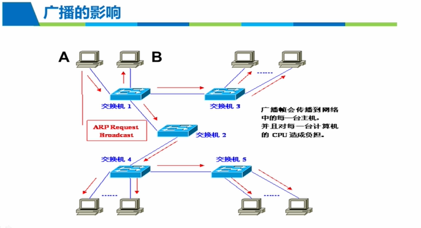

#### 三、VPN的分类

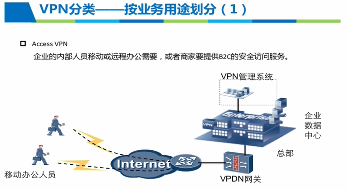

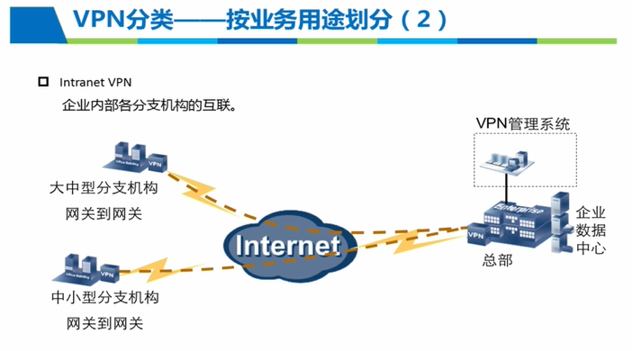

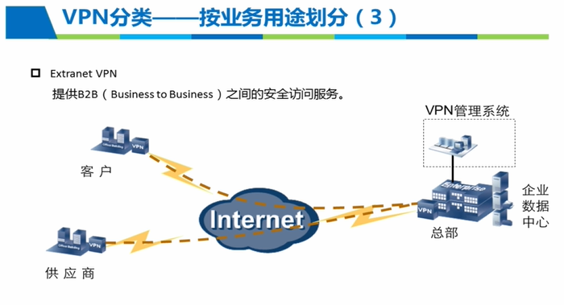

#### 四、VPN常见技术

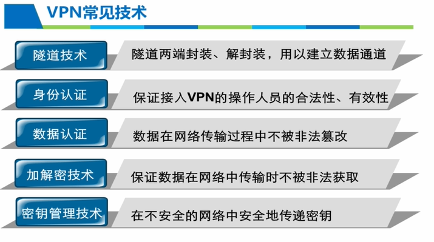

#### 五、VPN体系结构

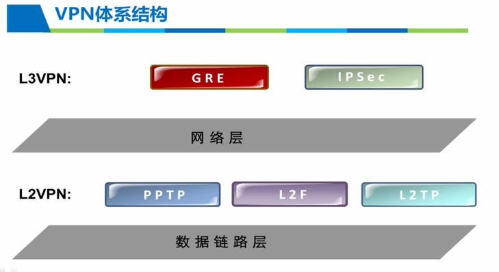

L3VPN三层VPN：VPN技术工作在协议站的网络层,以IPSEC为例：IPSEC报头和IP抱头工作在同一个层次，封装报文时，要么是以IP 应IP的方式进行封装，要么是IPsec报头与IP报头同时对数据载各进行封装，除IPsec VPN技术外主要的三层VPN技术还有GRE-VPN（产生时间较早，实现机制比较简单，可以实现任意一种网络协议在另一种网络协议上封装，与IPsec相比，安全性没有得到保证，只能提供简单的安全机制）

L2VPN二层VPN：指VPN技术工作在我们协议提到的数据链路层

二层VPN主要包括的协议有：

- 点到点的隧道协议PPTP
- 二层转发协议L2F
- 二层隧道协议L2TP

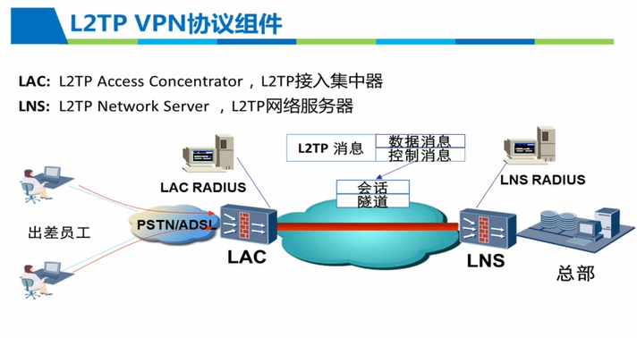

控制信息：隧道和会话的链接建立维护及删除

数据消息：封装PPP帧并在隧道上进行一个传输

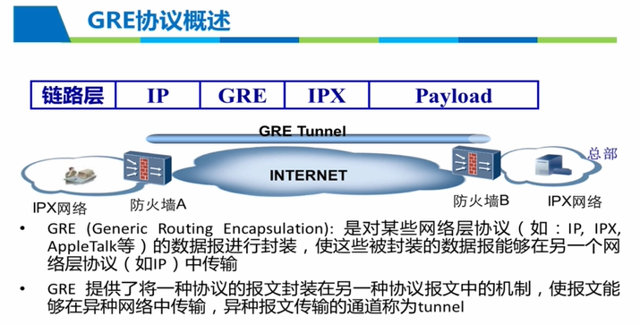

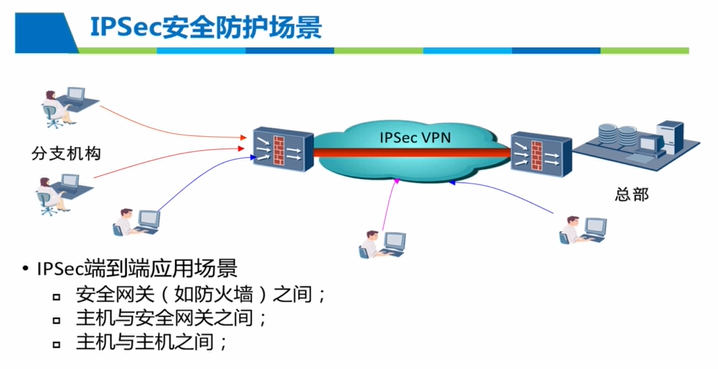

#### 六、VLAN接口属性及常见配置

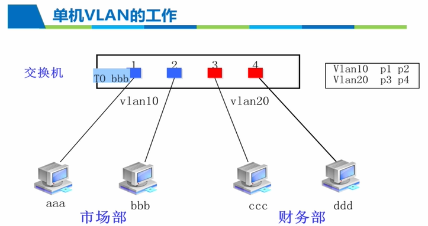

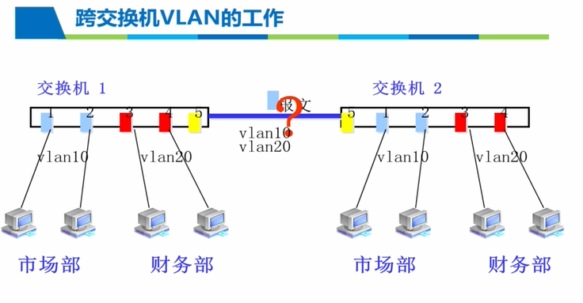

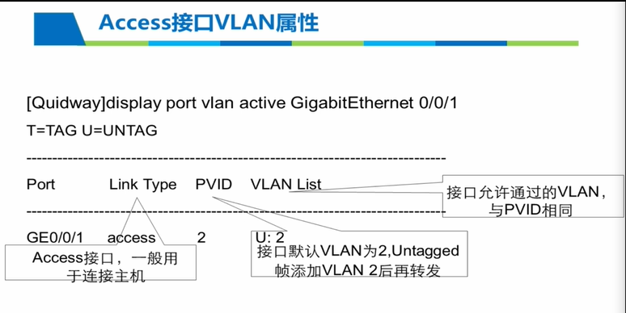

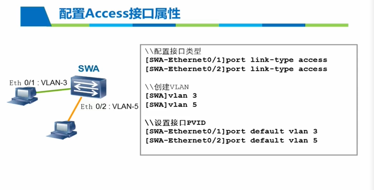

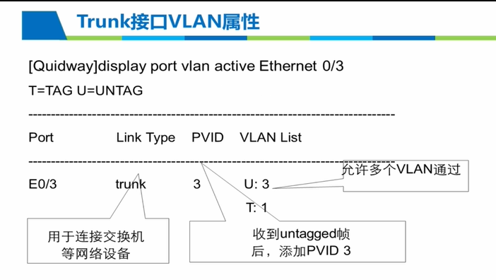

#### 七、(操作)基于端口的VLAN划分

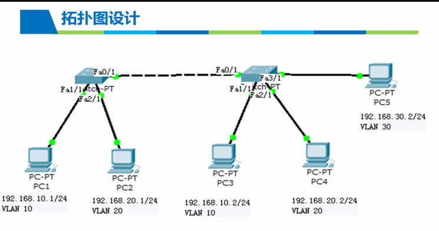

Cisco Packet Tracer 模拟器：思科模拟器，仿真上图

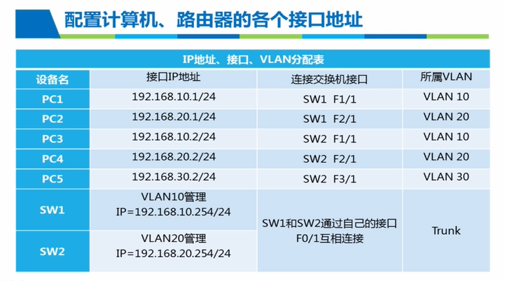

电脑配置：点击仿真图--Desktop--IP Configuration配置ip地址，如下：完成后关闭

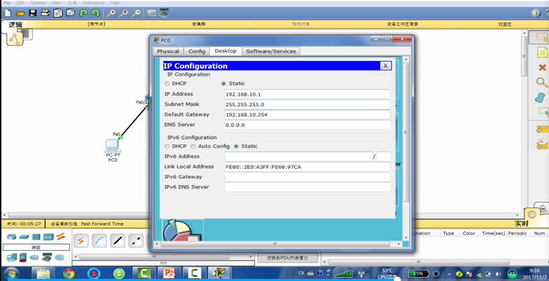

交换机配置：

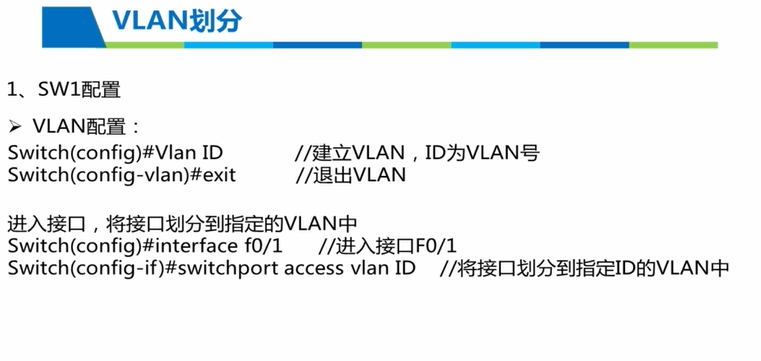

交换机建立：交换机仿真图--CLI：如图

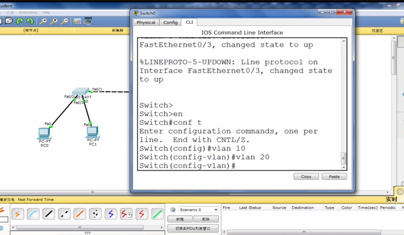

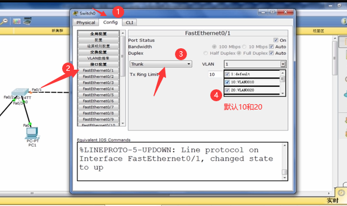

重复上述步骤：分别配置两个交换机和其下的多个接口

对ip进行管理配置，

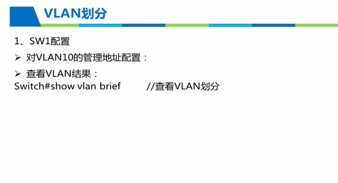

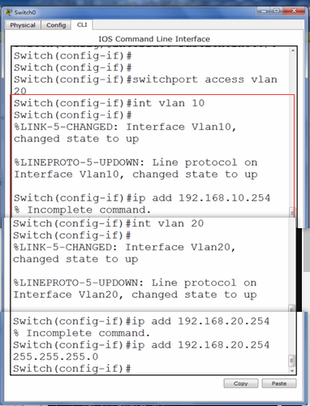

配置完成显示信息，也可以命令查看

查看配置信息：show running命令

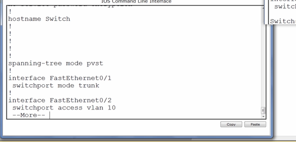

发送检测

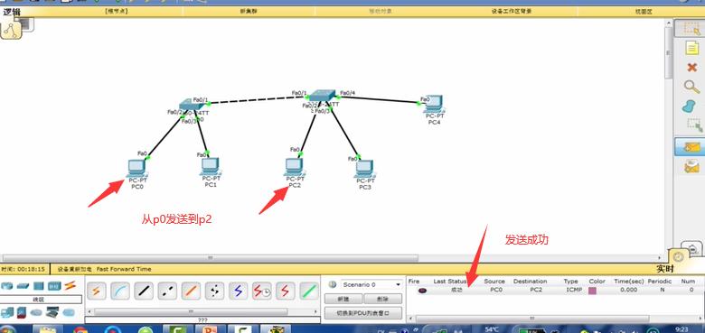

总结：

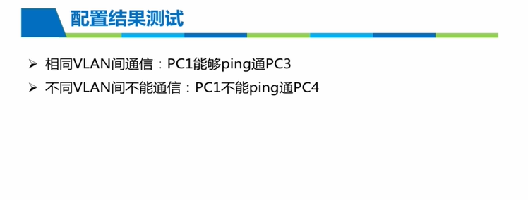

#### 八、(操作)VPN服务器的架设

VPN服务器：客户端新建一个连接，输入合法用户名和密码，即可连接到VPN服务器。

系统架设VPN服务器：步骤

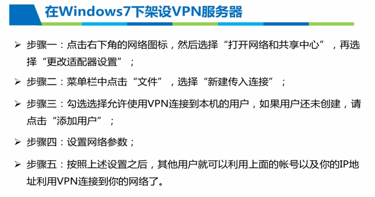

### 【10】防火墙与漏洞扫描

### 【11】RAID管理

### 【12】分布式文件系统配置使用

### 【13】数据备份方法分析

### 【14】网络线路运行维护

#### 01网络操作系统安装配置和使用

网络操作系统功能：NOS（Network Operating System）

#### 02web网络软件系统的安装配置与使用

#### 03设备驱动程序的安装与使用

### 【15】用户管理-理论

