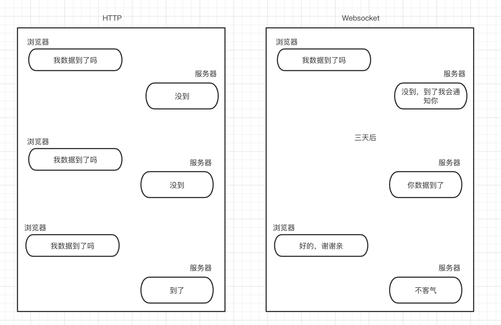

## websocket

- WebSocket 是一种网络通信协议。在 2009 年诞生，于 2011 年被 IETF 定为标准 RFC 6455 通信标准。

- WebSocket 是HTML5 开始提供的一种独立在单个 TCP 连接上进行**全双工(full-duplex)通讯**的**有状态**的通信协议，没有了请求和响应。连接一旦建立，就建立了真•持久性连接，双方可以随时向对方发送数据。

- 语法

  var ws = new WebSocket(path [,protocols]);

  path：要连接的 URL，这应该是 WebSocket 服务器将响应的 URL。

  protocols(可选)：一个协议字符串或者一个包含协议字符串的数组。

### 特点

- 全双工通信

  

  ​		内部使用一个基于tcp的连接，实现双方的双工通信。而且需要和http协议进行一次握手之后就施使用tcp进行数据传输（二进制数据传输），因为本身是浏览器和服务器之后的交互

- 协议升级：使用新协议ws: 或wss:

  ​	`ws:或wss:`,后者与前者的区别在于wss相比于ws多了一层安全协议。

     而ws协议是由http升级过去的，需要和http协议进行一次握手之后就施可以使用tcp进行数据传输

### 客户端

浏览器端进行使用（WebSocket 对象不支持 DOM Level 2 事件监听器）

- api  生命周期，四个事件，2个方法
  - open：连接成功
  - message：收到消息，接收JSON字符串
  - error：异常，出现连接、处理、接收、发送数据失败时
  - close：关闭 (是事件，也是方法)，
    - ws.onclose = function(){另一方发送关闭请求时}, 
    - ws.close()；
  - send：发送消息，发送JSON字符串
  
- 属性

  ws.readyState：连接时状态码
  ws.bufferedAmount

- 使用流程
  - 创建websocket客户端
  - 连接websocket服务器端
  - 连接成功后里可以设置message生命周期来接受服务器发来的数据
  - 可以使用send向服务器发送数据


```js
// 创建连接
let  URL = "ws://localhost:8081/socket/"; // 后端地址
let ws = new WebSocket(URL);

// 连接成功回调函数
ws.onopen =function(){ /* 连接成功后的逻辑 */}

// 收到数据回调函数
ws.onmessage =function(msg){
  let data = JSON.parse(msg.data);
}

// 发送数据（send 异步发送）：可以传递 string / ArrayBuffer / Blob。
ws.send("hello");   // 文本，对象使用JSON.stringify，或二进制
ws.send(Uint8Array.from(["h","e","l","l","o"]).buffer);   // 二进制
ws.send(new Blob(["h","e","l","l","o"]));  // 二进制

// 服务器接收（不做任何处理都是一样的）
<Buffer 68 65 6c 6c 6f>
<Buffer 00 00 00 00 00>
<Buffer 68 65 6c 6c 6f>
    
//关闭事件
ws.onclose = function () {//服务器连接关闭
    console.log("websocket已关闭");
};
//发生了错误事件
ws.onerror = function () {//服务器连接出错
    console.log("websocket发生了错误");
}
```

- 创建连接时，有可选第二参数，可以是单个协议名字字符串，或者包含多个协议名字字符串的数组，默认为""。用于表示客户端可以理解哪些子协议或者希望服务器接收哪些子协议。服务器可以从数据里面选择几个支持的协议进行返回，如果一个子协议都不支持，那么会直接导致握手失败，触发 onerror 回调，并断开连接。

### 服务器端

**利用socket.io实现简易聊天室思路**

1、客户端通过发送io.connect(url)连接请求与服务器端进行连接（若不适用socket.io库，使用new WebSocket(url)可以发送连接请求）;
2、服务器端通过监听‘connection’事件处理连接请求io.on(‘connection’,function(socket){//发送open事件}）；
3、客户端通过监听open事件确认是否与服务器端进行连接；
4、客户端通过send方法向服务器端发送信息；
5、服务器端通过监听message方法监听send的发送信息，并处理发送信息（将信息广播给其他聊天室成员和自己）；
6、服务器端通过监听disconnect方法判断客户端请求是否断开；

- 使用流程
  - 创建websocket服务器
  - 设置connection生命周期函数用于接受浏览器端发送过来的ws请求
  - 连接成功后里可以设置message生命周期来接受浏览器发来的数据
  - 可以使用send向浏览器端发送数据


```js
// 安装包-ws，并引入
npm i ws
const Websocket= require('ws');
const Websocket = require('nodejs-websocket');

// 服务器发送或接受数据都是二进制,要作为对象使用，需要进行转换
function binaryData(data) {
  //先用utf-8的方式解析数据再转换，避免乱码
  return JSON.parse(new TextDecoder("utf-8").decode(new Uint8Array(data)))
}

// 新建server.js,创建服务器连接
 var wss  = new Websocket.Server({port:"3000"},()=>{
   console.log('启动websocket服务器3000');
 });

// 当连接到新的浏览器ws请求时触发
let wsClient = null;//保存客户端的websocket对象方便后续操作
wss.on("connection",function(ws,req){
  console.log("服务器监听已打开");
  console.log(req.url);//请求参数，可以获取用户信息进行区分
  //设置接受数据的监听事件
  ws.on('message',function(data){
    data = binaryData(data);
    ws.send("已收到，您发的 信息为"+message);
  });
});


// 服务器主动发送消息
wsClient.send(内容);//主动向客户端发送消息
```

- 其中`ws`就是对应浏览器的websocket套接字,req是一个nodejs封装的对象，里面包含了请求和相关信息以及地址。其中有个url属性可以拿到连接时提供的参数
- `message`:就是针对该浏览器连接进行监听，当有数据过来时会进行调用（传递的是二进制数据，所以如果需要转为字符串再进行处理--查看细节处理部分）

- 服务器端主动发送消息：在connection事件获取的套接字`ws中提供了send()用于发送数据到指定的浏览器端中

```js
// 另一种创建方式
// 引入nodejs-websocket包
const wss = require('nodejs-websocket')
 
// 当前所处状态
const type_ENTER = 0 //进入聊天室状态
const type_DATA = 1 //发送信息状态
const type_LEAVE = 2 //离开聊天室状态
var count = 0 //当前用户数量
var server = wss.createServer((ws) =>{
    console.log("有用户连接了,创建连接成功");
    count++
    ws.userName = `用户${count}`
    brodCast({
        type: type_ENTER,
        msg: `${ws.userName}进入了聊天室~`,
        time: new Date().toLocaleTimeString()
    })
    // 监听消息
    ws.on("text", function (data) {
        console.log(data);
        brodCast({
            type: type_DATA,
            msg: data,
            time: new Date().toLocaleTimeString()
        })
    })
    // 监听连接关闭
    ws.on("close", function (code, reason) {
        count--
        brodCast({
            type: type_LEAVE,
            msg: `${ws.userName}离开了聊天室~`,
            time: new Date().toLocaleTimeString()
        })
    })
    // 监听异常
    ws.on('error', () => {
        console.log("用户连接异常~");
    })
    
    // unkown
    ws.on("open", ()=>{
       console.log('open!');
    })
})
 
// 广播
function brodCast(msg) {
    server.connections.forEach(item => {
        item.send(JSON.stringify(msg))
    })
}
server.listen(8081, () => {
    console.log("websocket服务启动成功了~");
})
```


### websocket通信

- 流程
  - 浏览器发送以`ws:或wss:`开头的协议，请求头中包含了升级协议以及使用版本等信息。服务器的响应字段包括了是否切换成功以及对应key的加密文本之类的。如果握手成功，那么http通信结束，后续的所有交互都是websocket协议在支撑直至结束。
- 请求部分
  - Sec-WebSocket-Key：由浏览器随机生成，提供基本防护，防止恶意或无意连接
  - Sec-WebSocket-Version: 13：客户端使用的 WebSocket 协议版本
  - Sec-WebSocket-Extensions: permessage-deflate; client_max_window_bits；可选的客户端支持的协议扩展列表
  - 请求的 URL 是 ws:// 或者 wss:// 开头的，而不是 HTTP:// 或者 HTTPS://。由于 websocket 可能会被用在浏览器以外的场景，所以这里就使用了自定义的 URI。类比 HTTP，ws协议：普通请求，占用与 HTTP 相同的 80 端口；wss协议：基于 SSL 的安全传输，占用与 TLS 相同的 443 端口
  - Connection: Upgrade：升级到 websocket 协议
- 响应部分
  - HTTP/1.1 101 Switching Protocols：101 HTTP 响应码确认升级到 WebSocket 协议
  - Sec-WebSocket-Accept：是经过服务器确认后，并且加密之后的 Sec-WebSocket-Key


### 关于ArrayBuffer 

- 概念： 

  `ArrayBuffer`对象、`TypedArray`视图和`DataView`视图是 JavaScript 操作二进制数据的一个接口。属于独立的规格（2011 年 2 月发布），ES6 将它们纳入了 ECMAScript 规格，并且增加了新的方法。它们都是以数组的语法处理二进制数据，所以统称为 `二进制数组`。

  这个接口的原始设计目的，与 WebGL 项目有关。所谓 WebGL，就是指浏览器与显卡之间的通信接口，为了满足 JavaScript 与显卡之间大量的、实时的数据交换，它们之间的数据通信必须是二进制的，而不能是传统的文本格式。文本格式传递一个 32 位整数，两端的 JavaScript 脚本与显卡都要进行格式转化，将非常耗时。这时要是存在一种机制，可以像 C 语言那样，直接操作字节，将 4 个字节的 32 位整数，以二进制形式原封不动地送入显卡，脚本的性能就会大幅提升。

  二进制数组就是在这种背景下诞生的。它很像 C 语言的数组，允许开发者以数组下标的形式，直接操作内存，大大增强了 JavaScript 处理二进制数据的能力，使得开发者有可能通过 JavaScript 与操作系统的原生接口进行二进制通信

- 分类

  二进制数组(3类)。

  **（1）**`ArrayBuffer`**对象**：代表内存之中的一段二进制数据，可以通过“视图”进行操作。“视图”部署了数组接口，这意味着，可以用数组的方法操作内存。

  **（2）**`TypedArray`**视图**：共包括 9 种类型的视图，比如`Uint8Array`（无符号 8 位整数）数组视图, `Int16Array`（16 位整数）数组视图, `Float32Array`（32 位浮点数）数组视图等等。

  **（3）**`DataView`**视图**：可以自定义复合格式的视图，比如第一个字节是 Uint8（无符号 8 位整数）、第二、三个字节是 Int16（16 位整数）、第四个字节开始是 Float32（32 位浮点数）等等，此外还可以自定义字节序。

  简单说，`ArrayBuffer`对象代表原始的二进制数据，`TypedArray`视图用来读写简单类型的二进制数据，`DataView`视图用来读写复杂类型的二进制数据

- 哪些使用了二进制数据

  - [Canvas](#canvas)
  - [Fetch API](#fetch-api)
  - [File API](#file-api)
  - [WebSockets](#websocket)
  - [XMLHttpRequest](#ajax)

- 详细内容-见语雀：es6语法 ：https://www.yuque.com/bilent/vxz4hd/28.arraybuffer 

### websocket扩展

- **为什么需要websocket**

  - 应用场景：`在线聊天实时消息传输`、`设备管理` 
  - - 短轮询（polling）：客户端频繁的向服务器发送请求来获取最新数据。每次请求都是完整的http数据包，包括头部以及其他信息，很费带宽。可以用ajax来实现
    - 长轮询（long polling）：长轮询是对轮询的改进版，客户端发送 HTTP 给服务器之后，有没有新消息，如果没有新消息，就一直等待。直到有消息或者超时了，才会返回给客户端。消息返回后，客户端再次建立连接，如此反复。这种做法在某种程度上减小了网络带宽和 CPU 利用率等问题。但实时性不高，因为每次tcp连接都是3次挥手四次之类的，万一同时数据两过大，那么延迟会非常明显。
      - 实现方式：客户端打开一个到服务器端的 AJAX 请求，然后等待响应，服务器端需要一些特定的功能来允许请求被挂起，只要一有事件发生，服务器端就会在挂起的请求中送回响应并关闭该请求。客户端在处理完服务器返回的信息后，再次发出请求，重新建立连接，如此循环
    - iframe流或sse
  - 需求：短开销、实时性、双工、兼容性好。

- **websocket优点**

  - 较少的控制开销，在连接创建后，服务器和客户端之间交换数据时，用于协议控制的数据包头部相对较小。在不包含扩展的情况下，对于服务器到客户端的内容，此头部大小只有2至10字节（和数据包长度有关）；对于客户端到服务器的内容，此头部还需要加上额外的4字节的掩码。相对于 HTTP 请求每次都要携带完整的头部，此项开销显著减少了。
  - 更强的实时性，由于协议是全双工的，所以服务器可以随时主动给客户端下发数据。相对于HTTP请求需要等待客户端发起请求服务端才能响应，延迟明显更少；即使是和Comet等类似的长轮询比较，其也能在短时间内更多次地传递数据。
  - 长连接，保持连接状态。与HTTP不同的是，Websocket需要先创建连接，这就使得其成为一种有状态的协议，之后通信时可以省略部分状态信息。而HTTP请求可能需要在每个请求都携带状态信息（如身份认证等）。
  - 双向通信、更好的二进制支持。与 HTTP 协议有着良好的兼容性。默认端口也是 80 和 443，并且握手阶段采用 HTTP 协议，因此握手时不容易被屏蔽，能通过各种 HTTP 代理服务器。
  - 缺点：部分浏览器不支持（支持的浏览器会越来越多）。
  - 应用场景：较新浏览器支持、不受框架限制、较高扩展性

- **传输数据处理**

  - WebSocket 对传输的格式没有任何限制，可以是文本也可以是二进制，都可以。协议中通过 Opcode 类型字段来区分是 UTF-8 还是二进制。WebSocket API 可以接收 UTF-8 编码的 DOMString 对象，也可以接收 ArrayBuffer、 ArrayBufferView 或 Blob 等二进制数据。

  - 浏览器对接收到的数据，如果不手动设置任何其他选项的话，默认处理是，文本是默认转成 DOMString 对象，二进制数据或者 Blob 对象会直接转给给应用，中间不做任何处理
  - 如果转换成了 Blob 对象，就代表了一个不可变的文件对象或者原始数据。如果不需要修改或者不需要切分它，保留成 Blob 对象是一个好的选择。如果要处理这段原始数据，放进内存里面处理明显会更加合适，那么就请转换成 arraybuffer 类型

- WebSocket **数据帧**

  - WebSocket 另一个高级组件是：自动二进制消息分帧机制。WebSocket 会把应用的消息分割成一个或多个帧，接收方接到到多个帧会进行组装，等到接收到完整消息之后再通知接收端。

    - 多个帧可以乱序发送，最终会通过帧头部的标识符来进行排序组装。而且针对于相同的帧有专门的算法来去冗余，达到帧复用的目的(以http2举例)

      

    - 只用了一次tcp通道 ，就可以完成所有的请求和响应。大大提高了效率

  - http2.0也是采用二进制分帧机制。但是不能做到和websocket一样服务器也可以实时推送数据到客户端。 后面可以使用http2.0以及sse来模拟websocket的效果。

  - SSE简单说就是，借助http协议支持分块传输这一特性。在响应报文里，设置Content-Type: text/event-stream，如此一来响应报文实体就可以多次从服务器返回给客户端，只需要约定好边界就好，比如SSE的边界就是以空行作为消息分隔符。


### 问题

**1、websocket和http的区别** 

1. 单和双
2. 有无状态：**WebSocket协议** 是长连接，一次初始化后，所有请求和响应都是这个TCP通行，http请求后关闭。
3. 协议不同

**2、websocket的通信原理** 

1. 首先浏览器发送了http请求，服务器接受后是websocket服务器，所以在返回数据之前就会通知浏览器升级协议，（请求头中的`connection:upgrade`）表示升级协议为websocket
2. 升级之后后续 的数据交互就是由websocket来进行处理

**3、websocket传递的数据是什么类型** 

二进制，只不过浏览器传入的是文本的话，那么服务器可以借助拼接字符串的方式转为文本，默认服务器接受的数据类型的是二进制，具体来讲是一个buffer数组

**4、WebSocket和Socket的区别** 

[Socket](https://so.csdn.net/so/search?q=Socket&spm=1001.2101.3001.7020):  `应用层`与`TCP/IP协议通信`的中间`软件抽象层`，它是一组接口。

WebSocket则不同，它是一个完整的`应用层协议`，包含一套标准的API。


**扩展部分前端** :添加错误捕获


```js
// data
wsUrl: 'ws://127.0.0.1:8080',
    websocket: null

// 初始化 websocket
initWebSocket () {
    try {
        if (this.websocket && this.websocket.readyState == 1) {
            this.stopWebSocket()
        }
        this.websocket = new WebSocket(this.wsUrl);
        this.websocket.onopen =  (evt) => {
             //console.log(ws.readyState);
            if (websocket.readyState === 1) {
               websocket.send('sub|EURUSD|GBPUSD');
               alert('open')
            }
        };
        this.websocket.onclose =  (evt) => {
            alert('DISCONNECTED')
        };
        this.websocket.onmessage =  message
        this.websocket.onerror =  (evt) => {
            console.log(evt.data )
        };
    } catch (exception) {
        console.log(exception )
    }
},
    // 停止
    stopWebSocket(){
        if (this.websocket){
            this.websocket.close();
        }
    },
        // 发送信息
        sendMessage(data){
            this.websocket.send(data);
        }
}

function message(evt){
        //console.log(1);
    //console.log(evt.data);
    var blob = evt.data;
    //console.log(parseBlob(blob));
    //通过FileReader读取数据
    var reader = new FileReader();
    //以下这两种方式我都可以解析出来，因为Blob对象的数据可以按文本或二进制的格式进行读取
    //reader.readAsBinaryString(blob);
    //reader.readAsText(blob, 'gbk2312');
    reader.readAsArrayBuffer(blob);
    reader.onload = function () {
        //这个就是解析出来的数据
        //console.log(this.result);
        var dataview = new DataView(this.result);
        //var pz = dataview.substring(0);
        var bid = dataview.getFloat64(7, true).toFixed(5);
        var ask = dataview.getFloat64(15, true).toFixed(5);
        var last = dataview.getFloat64(23, true).toFixed(5);
        var volume = dataview.getBigUint64(31, true);
        //var datetime_msc = dataview.getBigInt64(39,true);
        var datetime_msc = dataview.getInt32(39, true);
        //var t = getUint64(dataview,39,true);
        console.log(bid, ask, last, volume, new Date(datetime_msc).toISOString());
    }
}
```

